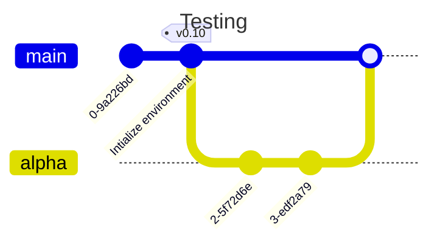
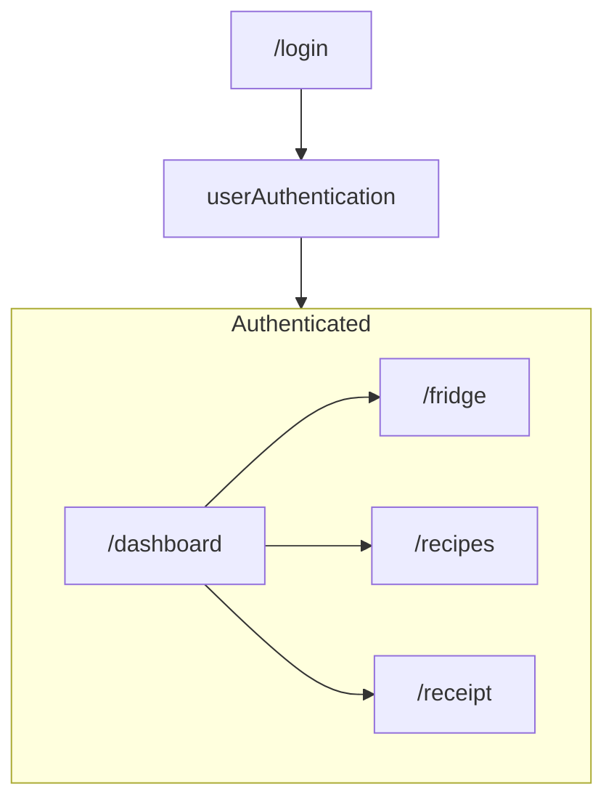
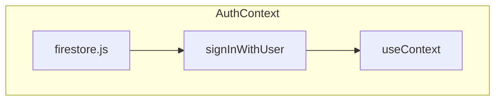

# FoodMe-Test 

Playground for building a CI/CD process before integrating into my side project

## Content
- [Tech Stack](#tech-stack)
- [Github](#github)
    - [Github Actions](#github-actions)
- [Basic Application Design](#basic-application-design)
    - [Functions by Page](#functions-by-page)
- [In-depth breakdown](#in-depth-breakdown)
    - [Authentications](#authentication)

## [Tech Stack](#tech-stack) 
- Firebase: 
    - Firestore (NoSQL)
    - Authentication 
- React with Vite 
- React Router
- Tailwindcss
- Github Actions 
- Cypress for e2e and component testing

## [Github](#github)


Playing with gitGraph

### [Github Actions](#github-actions)

I have been having issues with firebase pre-configured github actions when I want to upload the entire project to github. 
</br> 
It runs fine with in a branch with only `/hosting` as the run executes fine possibly without `firebase-tools` packaged.
<br> 
For now, I decided to default the working directory to `/hosting` for both merge and pull request workflow

```
defaults:
  run:
    shell: bash
    working-directory: ./hosting


jobs:
  build_and_deploy:
    runs-on: ubuntu-latest
    steps:
      - uses: actions/checkout@v3
      - run: npm ci && npm run build
      - uses: FirebaseExtended/action-hosting-deploy@v0
        with:
            ...
        env:
          FIREBASE_CLI_EXPERIMENTS: webframeworks //required 
```

I'll be interested in checking out the extension [Changed-Files](https://github.com/tj-actions/changed-files) to see if i can atomize the workflow


## [Basic Application Design](#basic-application-design) 




### [Functions by Page](#functions-by-page)

#### /dashboard
- Dashboard for quick view of items

#### /recipes 
- Handles recipe searching 

#### /fridge
- Grocery inventory management 

#### /reciept 
- reciept management 

<!-- - Once uploaded to Cloud Storage, receipt will be scanned with Google Vision OCR and Document AI
    - The returned text will be scraped out for item and item price with Google NLP API -->


## [In-depth-breakdown](#in-depth-breakdown)
More for personal overview of the intricacies as a sanity check 

### [Authentication](#authentication)


