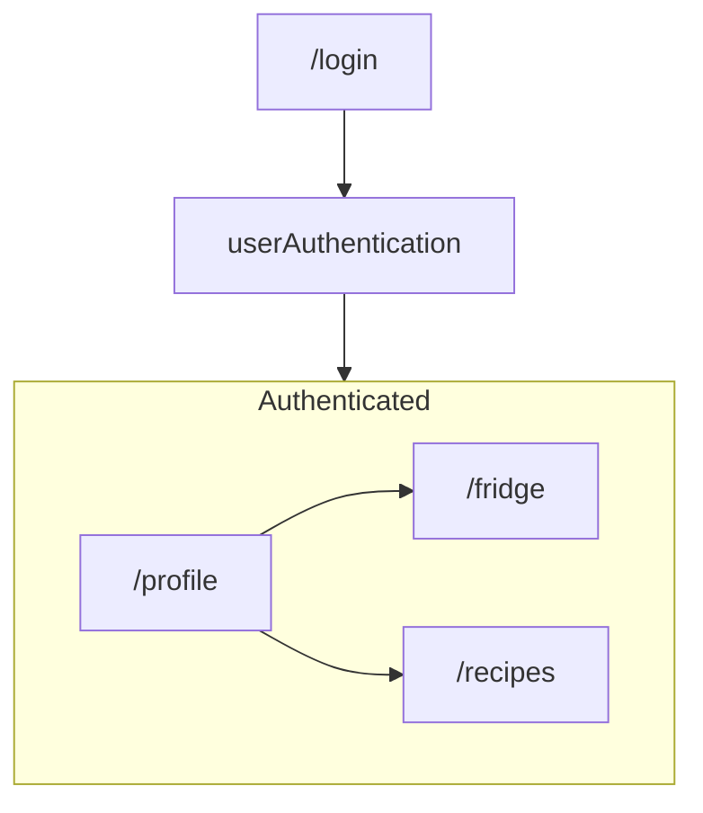

# FoodMe-Test 

Playground for building a CI/CD process before integrating into my side project

## Tech Stack 
- Firebase: 
    - Firestore (NoSQL)
    - Authentication 
- React with Vite 
- Tailwindcss
- Github Actions 
- Cypress for e2e and component testing

## Basic Application Design 

---
### Functions by Page
#### /profile
- Dashboard for quick view of items

#### /recipes 
- Handles recipe searching 

#### /fridge
- Grocery inventory management 

## Firebase Firestore
