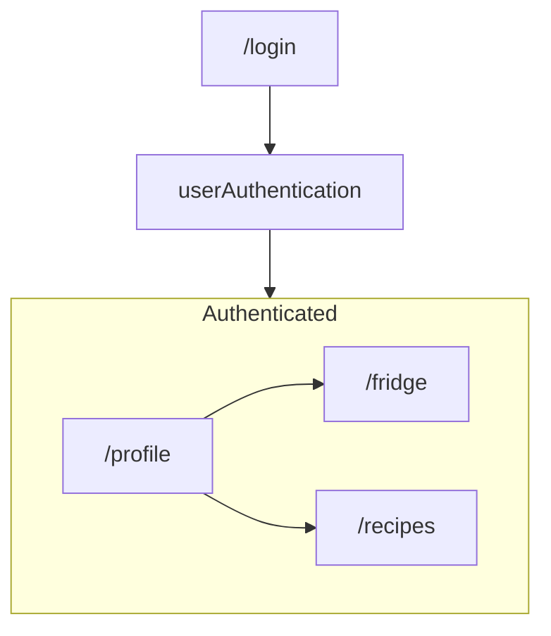

# FoodMe-Test 

Playground for building a CI/CD process before integrating into my side project

##
- [Tech Stack](#tech-stack)
- [Basic Application Design](#basic-application-design)
    - [Functions by Page](#functions-by-page)
- [Github](#github)
    - [Github Actions](#github-actions)

## [Tech Stack](#tech-stack) 
- Firebase: 
    - Firestore (NoSQL)
    - Authentication 
- React with Vite 
- Tailwindcss
- Github Actions 
- Cypress for e2e and component testing

## [Basic Application Design](#basic-application-design) 

### [Functions by Page](#functions-by-page)
#### /profile
- Dashboard for quick view of items

#### /recipes 
- Handles recipe searching 

#### /fridge
- Grocery inventory management 

## [Github](#github)

### [Github Actions](#github-actions)

